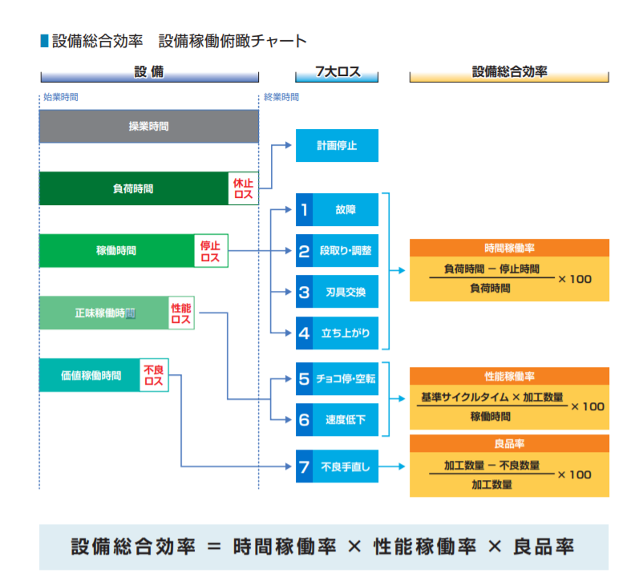

# OEE全局设备效率

## 1.简介

全局设备效率是Overall Equipment Effectiveness，简称OEE。长期的使用OEE工具，企业可以轻松的找到影响生产效率的瓶颈，并进行改进和跟踪。达到提高生产效率的目的，同时使公司避免不必要的耗费。

## 2.计算

> OEE=可用率X 表现性 X质量指数

计算的方法比较简单，得到OEE不是最终的目的，而是要分析各个损失，找出影响效率的原因，进而改进。

